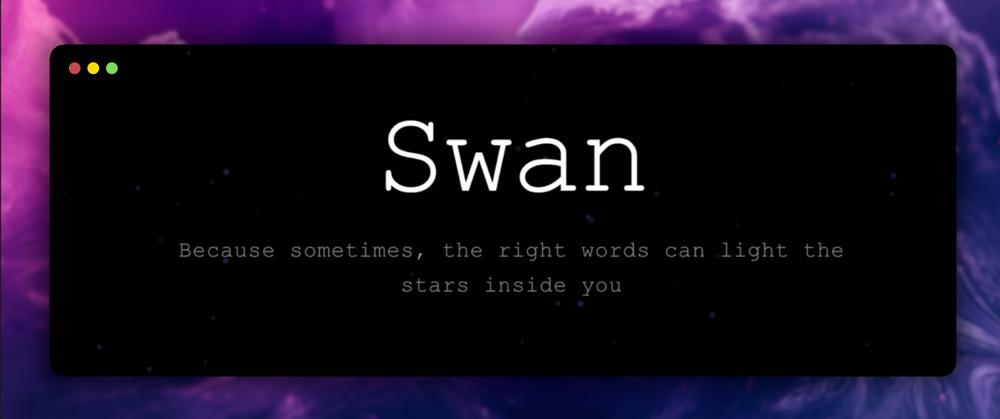
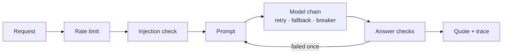

<div align="center">

# Swan

Because sometimes, the right words can light the stars inside you

[**swanexus.dev**](https://www.swanexus.dev) · [How it works](docs/architecture.md) · [Evaluation](evals/README.md)

[](https://github.com/1AyaNabil1/Swan_Quote_Generator/actions/workflows/test.yml)
[](LICENSE)



</div>

Swan writes short, original quotes in English and Arabic with Google Gemini. The model call
is the small part. Most of the code is about what happens around it on a public endpoint
where strangers type the input:

- **Guardrails, in both languages.** Topics and styles are checked for prompt injection in
  English, Modern Standard Arabic, Egyptian Arabic and Arabizi, after folding away the tricks
  that hide it (zero-width characters, diacritics, Arabic presentation forms, letter
  spacing). Every answer is checked before it is shown: right language, sensible length, no
  "Here is your quote:", no leaked instructions, not cut off, not recited. A failed check is
  regenerated once with the reason.
- **Resilience.** Outages are retried with backoff; rate limits and timeouts fall back to the
  next model; a model that keeps failing is skipped by a circuit breaker; everything shares
  one deadline. A safety refusal is final: it is never retried on another model.
- **Observability.** One JSON log line per request with every model call, failed check and
  token count; Prometheus metrics for outcomes, latency, tokens, guardrail hits, fallbacks and
  circuit state; a request ID on every response and log line.
- **Evaluation.** 63 cases measure quality, injection resistance and safety parity across
  English, MSA and Egyptian Arabic, with the guardrails on and off.
- **Tests.** 162 tests with a fake Gemini, strict mypy, Ruff, and a Docker smoke test in CI.

## How a quote is made



The full pipeline, threat model and design decisions are in
[docs/architecture.md](docs/architecture.md).

## Quick start

```bash
git clone https://github.com/1AyaNabil1/Swan_Quote_Generator.git
cd Swan_Quote_Generator
python -m venv .venv && source .venv/bin/activate
pip install -r requirements-dev.txt
cp .env.example .env          # then set GEMINI_API_KEY
python main.py                # http://localhost:8000, API docs at /docs
```

The React frontend is prebuilt in `static/build` and served by the same process. To work on
it: `cd static && npm install && npm start` (port 3000, proxied to the API).

With Docker: `docker build -t swan . && docker run -p 8000:8000 --env-file .env swan`.

## API

| Endpoint | |
|---|---|
| `POST /api/quotes/generate` | A quote for `category`, optional `topic` and `style`, `language` (`en`, `ar`), `length` (`short`, `medium`, `long`) |
| `GET /api/quotes/random` | A random quote |
| `GET /api/quotes/categories` | The categories |
| `GET /health` | Version, model chain, whether guardrails are on |
| `GET /metrics` | Prometheus metrics (behind `METRICS_TOKEN` if set) |

```bash
curl -X POST localhost:8000/api/quotes/generate -H 'content-type: application/json' \
  -d '{"category": "wisdom", "topic": "patience", "length": "short"}'
```

```json
{
  "quote": "Patience is not waiting, but the calm acceptance that things unfold in their own season.",
  "author": "Swan",
  "category": "wisdom",
  "language": "en",
  "model": "gemini-2.5-flash",
  "timestamp": "2026-10-02T17:08:52.179592Z"
}
```

Asked for `"language": "ar"` and a Shakespearean style, the live site wrote
«العيشُ مسرحٌ، والناسُ شخوصٌ؛ فارتدِ الرداءَ وقدّمْ روايتك.»

`model` names the fallback when one answered. Every response has an `X-Request-ID`; quote
responses also carry `X-RateLimit-Limit` and `X-RateLimit-Remaining`.

Errors are `{"detail": "..."}`, and the message is always safe to show:

| Status | When |
|---|---|
| 422 | Invalid request; an instruction written into the topic or style; or Gemini refused the topic |
| 429 | Over the rate limit (10 a minute per client, 120 overall); see `Retry-After` |
| 502 | No model returned a quote that passed the checks, after one regeneration |
| 503 | Every model is rate limited or temporarily skipped |
| 504 | No quote within `REQUEST_TIMEOUT` |

## Configuration

Environment variables, or a `.env` file. The ones you are most likely to change:

| Setting | Default | |
|---|---|---|
| `GEMINI_API_KEY` | | Required |
| `DEFAULT_MODEL` | `gemini-2.5-flash` | With `THINKING_BUDGET=0`, thinking is off |
| `FALLBACK_MODELS` | `[]` | JSON list of specs, e.g. `["gemini-3.5-flash-lite@minimal"]` |
| `REQUEST_TIMEOUT` | `30` | Seconds per request, across retries and fallbacks |
| `LLM_ATTEMPT_TIMEOUT` | `15` | Seconds per model call |
| `GUARDRAILS_ENABLED` | `true` | Off skips the injection check and stops enforcing answer checks |
| `MAX_GENERATION_ATTEMPTS` | `2` | Answers per request, counting the regeneration |
| `RATE_LIMIT_PER_CLIENT` / `RATE_LIMIT_GLOBAL` | `10` / `120` | Quotes per minute |
| `METRICS_TOKEN` | | Bearer token required on `/metrics` |
| `ALLOWED_ORIGINS` | `[]` | Extra browser origins for CORS; the bundled frontend needs none |

All of them, with comments, are in [.env.example](.env.example).

## Development

```bash
pytest                       # 162 tests; Gemini is faked, no key or network needed
ruff check . && ruff format --check app tests evals
mypy                         # strict
python -m evals.run --fake   # the eval harness, offline
python -m evals.run          # the real evals; needs GEMINI_API_KEY (about 130 small calls)
```

CI runs the first four on every push, then builds the Docker image and checks that it
serves `/health`, `/metrics` and the frontend, and that it rejects an injection before any
model call. The `eval` workflow runs the real evals on demand.

```
app/
├── api/              routes, request and response models, error messages, rate limiting
├── guardrails/       injection detection, answer checks, text normalization
├── llm/              provider-neutral types, Gemini provider, retries, fallbacks, breakers
├── trace.py          one record per generation, logged and counted
└── observability.py  request IDs, Prometheus metrics
evals/                cases, runner, report
docs/architecture.md  pipeline, threat model, decisions
static/               React frontend (Tailwind, Framer Motion), prebuilt in static/build
tests/
```

## Deployment

[swanexus.dev](https://www.swanexus.dev) runs the Docker image on Render, behind Cloudflare,
and redeploys on every push to `main`. The image runs one uvicorn worker, which keeps the
in-memory rate limits, circuit breakers and metrics accurate; the
[architecture notes](docs/architecture.md#decisions) explain the trade-off.
`api/index.py` still wraps the app for Vercel, where the in-memory limits are much weaker.

## License

[MIT](LICENSE). Built by [Aya Nabil](https://ayanabil.vercel.app/) 🦢
