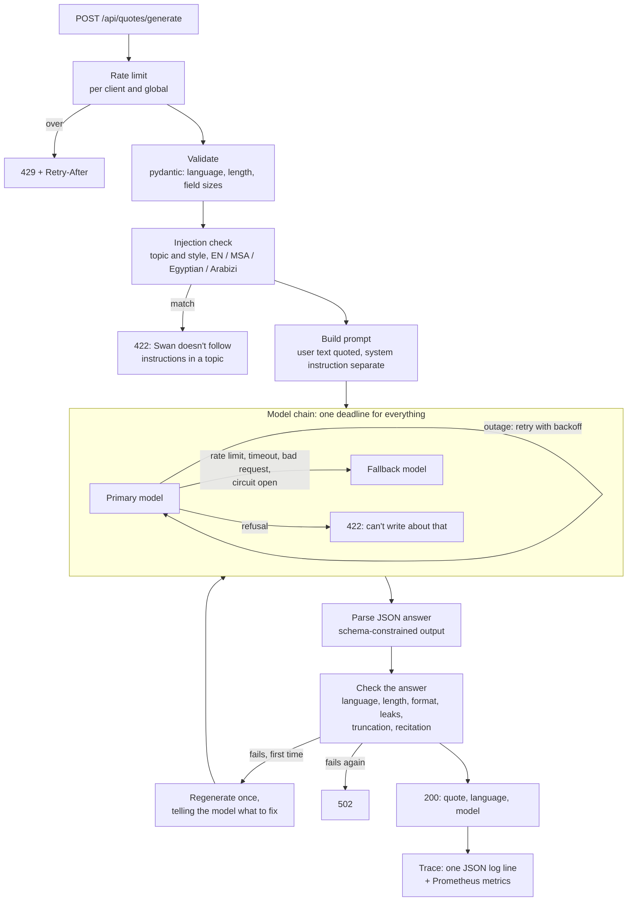

# How Swan works

Swan writes one short, original quote in English or Arabic. The model call is the easy part;
this document is about everything around it: what can go wrong between a user's text and the
quote they see, and what Swan does about each.

## A request, end to end

Code: `app/api/routes/quote_routes.py` (HTTP), `app/api/controllers/quote_controller.py`
(the pipeline), `app/guardrails/` (both checks), `app/llm/` (models and resilience),
`app/trace.py` and `app/observability.py` (logs and metrics).

## Threat model

Swan is a public, unauthenticated endpoint that spends a paid model quota on text strangers
write. What it defends against, and how:

| Threat | Defense |
|---|---|
| Someone drains the Gemini quota | Per-client and global sliding-window limits; one worker so the counts are whole; the global limit covers clients that forge `X-Forwarded-For` |
| Prompt injection in the topic or style ("ignore previous instructions…") | Bilingual pattern check on normalized text; user text quoted in the prompt; a system instruction that says topic and style are subject matter, never instructions; output checks as a second line |
| Obfuscated injection (zero-width characters, diacritics, Arabic presentation forms, full-width letters, "i g n o r e") | All folded away before matching (`app/guardrails/normalize.py`), plus a pass over text with spaces and punctuation removed |
| The model reveals its instructions | Output check for any six-word run copied from the system instruction |
| The model refuses in words and the refusal is shown as a quote | Output check for written refusals in English and Arabic; treated as a refusal (422) |
| Text in the wrong language, or a stray script (an Arabic quote with Chinese in it) | Output check on the share of letters in the requested script, and on any third script |
| Harmful content | Gemini safety filters at "medium and above" in all four categories; a refusal is final |
| Getting around a refusal by retrying | A refusal is never retried on another model or regenerated |
| Error messages leaking keys, IPs or stack traces | Every failure maps to a fixed message (`app/api/errors.py`); details go to the server log only |
| Logs collecting user text | The trace records whether a topic or style was given, never the text |
| Malicious `X-Request-ID` values in logs | Kept only if they are 1 to 64 plain characters; otherwise replaced |

Not defended: a determined attacker who rephrases an injection in words the patterns don't
cover. The output checks limit what such an attack can achieve (the answer must still be a
short quote in the right language), and the eval suite measures how often attacks get
through. The patterns are a cheap first layer, not a guarantee.

## Decisions

**Pattern-based injection detection, not a classifier model.** It is deterministic, costs
nothing per request, adds no latency, explains itself (each finding names its rule), and is
easy to test in two languages. The cost is recall against novel phrasings, which is why it is
one layer of several and why the eval suite includes attacks it is not written to catch.
The patterns are narrow on purpose: "ignore the rules", "act as a leader" and "بدون قيود"
are good topics for a quote, and the tests pin that down.

**A refusal ends the request.** The fallback chain exists for outages and quotas. Sending a
refused prompt to a second model, or regenerating it, would turn the chain into a way to shop
for a model that says yes. That holds for refusals the model writes in words ("I cannot
fulfill this request…", «عذراً، لا أستطيع…») as much as for safety-filter blocks: the first
eval run caught Swan returning such a sentence as a quote.

**Regenerate once, with the reason.** Most failed checks (an English sentence in an Arabic
quote, a "Here is your quote:" prefix) are fixed by telling the model what was wrong. A second
failure is returned as an error rather than looping, which keeps worst-case cost and latency
at two calls. The hint describes the rule, never quotes the rejected output back.

**Schema-constrained JSON output.** The model must answer `{"quote": "..."}`. That replaced a
function that stripped "As an AI," and "**English Translation:**" prefixes after the fact. A
malformed answer is now a detectable failure instead of something cleaned up by guesswork.

**One deadline for the whole request, and a cap per call.** Retries and fallbacks share
`REQUEST_TIMEOUT` (30s), so they can never make a request slower than that.
`LLM_ATTEMPT_TIMEOUT` (10s) caps each call. Calls occasionally stall (the first eval run saw
two hang past 15s), so a timed-out call is retried once and the fallback still has time.

**Circuit breakers per model.** After five failures in a row a model is skipped for thirty
seconds, so requests go straight to the fallback instead of waiting for a model that is down.
The state is exported as a metric.

**Thinking turned down, per model.** A quote needs no reasoning. Tested against the live API:
`gemini-3.6-flash` left to think spent all 300 output tokens thinking and was cut off, and
`gemini-3.8-flash` answered "Here is the JSON requested:" instead of JSON. 2.5 models take a
thinking budget (0 turns it off) while `gemini-3.5-flash-lite` rejects a budget and takes a
level, so every model is a spec that carries its own setting: `gemini-2.5-flash-lite@0`,
`gemini-3.5-flash-lite@minimal`.

**The default model is chosen by the evals.** `gemini-2.5-flash`, the original model, is no
longer offered to new API projects, so a fresh clone would only ever get errors.
`gemini-3.5-flash-lite@minimal` replaced it after passing every quality case on the first
answer with a median latency under a second; `gemini-2.5-flash-lite@0` is the fallback.

**One worker, state in memory.** The service waits on Gemini, not the CPU, so one async
worker is enough. One process also keeps the rate limits, circuit breakers and metrics
accurate. Scaling out would need a shared store (Redis) for the limits and Prometheus'
multiprocess mode; neither is worth it at this traffic.

**Guardrails can be turned off.** `GUARDRAILS_ENABLED=false` skips the injection check and
records failed answer checks without enforcing them. It exists for the eval suite's "raw" mode,
which measures what the model does on its own.

## Observability

Every generation is one JSON log line with the request ID, outcome, each model call (model,
result, latency), failed checks, whether the first answer passed, tokens and duration. The
same data feeds `/metrics`:

| Metric | Labels |
|---|---|
| `swan_generations_total` | outcome, language |
| `swan_model_calls_total` | model, outcome |
| `swan_model_call_duration_seconds` | model |
| `swan_model_tokens_total` | kind (input, output) |
| `swan_regenerations_total` | |
| `swan_output_check_failures_total` | check |
| `swan_injections_blocked_total` | rule |
| `swan_rate_limited_total` | scope (client, global) |
| `swan_circuit_open` | model |
| `swan_http_requests_total`, `swan_http_request_duration_seconds` | method, route, status |

Routes are labelled by template, and the static frontend as one label, so arbitrary paths
can't create new time series.

## Evaluation

`evals/` measures quality, injection resistance and safety parity across English, Modern
Standard Arabic and Egyptian Arabic, with and without the guardrails. See
[evals/README.md](../evals/README.md).
